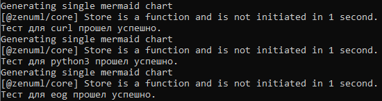

# Визуализатор пакетных зависимостей
## Задание
Разработать инструмент командной строки для визуализации графа 
зависимостей, включая транзитивные зависимости. Сторонние средства для 
получения зависимостей использовать нельзя.

Зависимости определяются по имени пакета ОС Ubuntu (apt). Для описания 
графа зависимостей используется представление Mermaid. Визуализатор должен 
выводить результат на экран в виде графического изображения графа.
Ключами командной строки задаются:

• Путь к программе для визуализации графов.

• Имя анализируемого пакета.

• Максимальная глубина анализа зависимостей.

• URL-адрес репозитория

Все функции визуализатора зависимостей должны быть покрыты тестами.

## Реализация
Программа была реализована на языке Python с использованием модулей argparese для парсинга аргументов командной строки и subprocess для запуска команды получения зависимостей пакета. 
## Тесты
Тесты реализованы с помощью модулей os для проверки сущетсвования выходного файла и subprocess для запуска программы. В процессе тестирования программа запускается для трёх разных пакетов - curl, python3 и eog - с разными значениями глубины. После создания файла с графом идёт сравнение полученного файла с эталонным.
### Результаты тестирования
